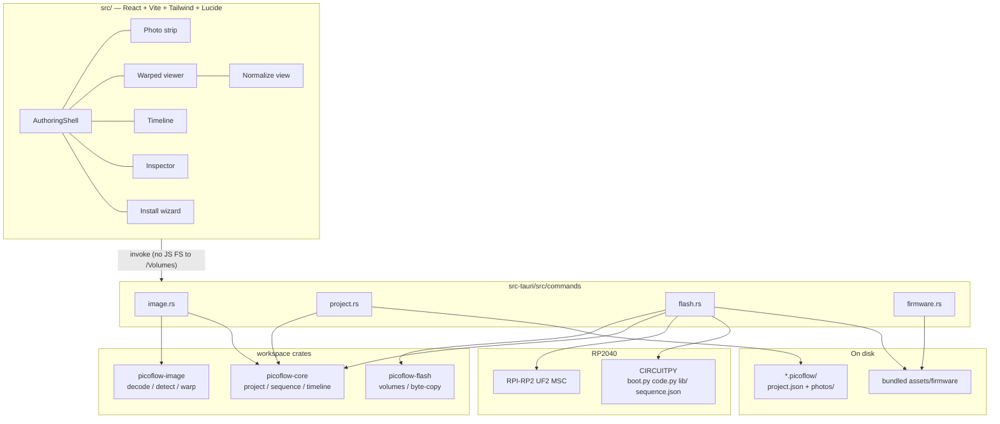
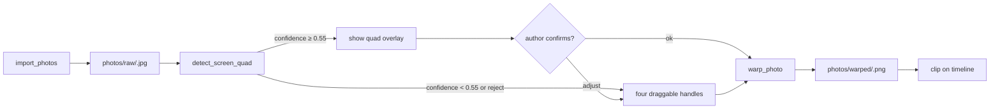

# PicoFlow — Implementation Design

| Field | Value |
|-------|--------|
| **Title** | PicoFlow v1 technical design (greenfield) |
| **Author** | Design-doc-writer (from PicoFlow spec by Ryan) |
| **Date** | 2026-09-01 |
| **Status** | Draft |
| **Source of truth** | `/Users/rpenf/Downloads/spec.md` (PRD + technical spec v0.1) |
| **Target repo** | `/Users/rpenf/code/velox/hid-automator` (empty; no git history) |

This document turns the PicoFlow spec into an implementation-ready design: crate layout, file paths, IPC, data formats, firmware, flash flow, tests, and a PR DAG. Product requirements are not reopened. Locked choices from spec §15 stay locked. Spec §16 open items were **resolved by the user on 2026-09-01** (see Open Questions).

---

## Overview

PicoFlow is a Tauri 2 desktop app that turns a photographed walkthrough of a device UI — initially an Android tablet out-of-box experience (OOBE) — into a timed HID sequence, then flashes that sequence onto an RP2040 / Raspberry Pi Pico. The board enumerates as a composite USB HID device and replays interactions (tap, swipe, keyboard, mouse) against the target.

The authoring model is a clip-based timeline: each photograph is a clip with an adjustable duration; actions are keyframes. Firmware (CircuitPython + a small runtime) and sequence data are separate. The sequence is a JSON file on the CIRCUITPY volume (YAML is not v1). The app bundles a pinned CircuitPython UF2, Adafruit HID, and the PicoFlow runtime so the author never visits circuitpython.org.

This is a greenfield repo. Every path below is proposed and **will live at** that location; nothing in `hid-automator` exists yet.

---

## Background & Motivation

Repeating a multi-step Android OOBE by hand is slow and does not scale across a bench of devices. Existing HID “rubber ducky” tools are static scripts: no visual model of the screens, no timeline, no way to retarget timing without rewriting firmware.

PicoFlow makes capture visual (photos of real screens), timing explicit (clips + keyframes), and deploy a one-click flash of bundled runtime plus sequence data. Operators receive a pre-flashed Pico, plug it into the tablet, and walk away.

Pain points the design must solve up front:

- Absolute pointing on Android is unproven for the target SKU. The HID spike is an early PR, not a late surprise.
- macOS Ventura+ Finder drag of UF2 onto `RPI-RP2` is unreliable because of xattrs. Copy must be raw bytes.
- Auto quad-detect will fail on glare/bezel. Manual four-handle UI is mandatory.
- Photo clips and actions will drift. The tool visualizes both layers; it does not “fix” semantics.

---

## Goals & Non-Goals

### Goals (v1 / P0)

- Import photos (JPEG/PNG everywhere; **HEIC on macOS is P0**), auto- or manually-normalize via a four-corner perspective warp, store raw + warped.
- Author a contiguous clip timeline with ripple-edit durations and a keyframe action track.
- Export a flattened sequence the on-device runtime can parse.
- Flash a stock Pico from a machine with no prior CircuitPython install, entirely inside the app.
- Replay as composite HID: keyboard + absolute pointing (absolute mouse default; digitizer fallback after spike).
- Sequence updates without re-flashing the UF2.
- macOS (Apple Silicon + Intel) as P0. Windows and Linux must not be designed out: the `VolumeSource` trait is the seam; FLASH-1 on Win/Linux is scheduled P1 (see Platform Notes — spec FLASH-1 vs §11).

### Non-goals (v1)

- OCR or on-screen text as a control signal (IMG-6).
- ML models for corner detection or screen understanding.
- Live camera / ADB / MDM capture. Photos only.
- First-class RP2350 / Pico 2 (P2).
- Cloud, sync, collaboration, undo history, looping, branching.
- Semantic validation that a keyframe “belongs” to the visible screen.
- picotool sidecar (FLASH-6, P2) unless MSC copy proves insufficient.
- Mouse **wheel** events. Spec §6.3 mentions wheel; spec §7.3 does not. v1 follows §7.3 (`mouse_move` / `mouse_button` only).

---

## Proposed Design

### Repo layout

Monorepo: Tauri 2 + React + TypeScript + Vite + Tailwind. Native work lives in workspace crates so timeline math, image ops, and flash logic can be unit-tested without the WebView.

```text
hid-automator/
  Cargo.toml                        # workspace: src-tauri, crates/*
  package.json                      # name: picoflow; scripts: dev, build, test, typecheck
  pnpm-lock.yaml
  tsconfig.json
  vite.config.ts
  tailwind.config.ts
  index.html
  README.md                         # clone, BOOTSEL, POSIX UF2 copy, udev (Linux P1). No brew/vcpkg.
  .github/workflows/ci.yml          # cargo test --workspace from repo root; pnpm test + typecheck
  .gitignore

  src/                              # React UI
    main.tsx
    App.tsx
    index.css
    types/
      generated.ts                  # ts-rs output from picoflow-core (committed)
      commands.ts                   # invoke wrappers
    store/
      editor.ts                     # zustand project + playhead
    layout/
      AuthoringShell.tsx
    features/
      photos/                       # strip, import
      normalize/                    # four-handle overlay
      viewer/                       # warped screen + tap/swipe overlay
      timeline/                     # clips + keyframes + playhead
      inspector/                    # selected clip/action
      preview/                      # transport
      install/                      # wizard modal
      project/                      # New / Open / Save / Duplicate / Export
    lib/
      coords.ts                     # pointer → normalized [0,1]
      timeline.ts                   # clip_at only (half-open); mutations are Rust commands
      ids.ts
      photoUrl.ts                   # convertFileSrc wrapper for project-relative photos

  src-tauri/
    Cargo.toml                      # package name: picoflow; workspace member
    tauri.conf.json                 # bundle ../assets/firmware; assetProtocol.enable, scope [] + CSP
    capabilities/default.json
    build.rs
    icons/
    src/
      main.rs
      lib.rs
      error.rs                      # AppError; lands in PR 1
      session.rs                    # allowed project dir, last dialog paths, last volumes
      commands/
        mod.rs
        image.rs
        project.rs
        flash.rs
        firmware.rs
        timeline.rs                 # ripple_clip, reorder_clips
      resources.rs                  # resolve bundled assets/firmware

  crates/
    picoflow-core/                  # project + sequence + timeline math
      Cargo.toml
      src/
        lib.rs
        ids.rs
        project.rs
        sequence.rs
        timeline.rs
        export.rs
      tests/
        timeline.rs
        sequence.rs
        fixtures/
          project_v1.json
          sequence_v1.json
    picoflow-image/                 # decode, quad-detect, warp
      Cargo.toml
      src/
        lib.rs
        decode.rs
        detect.rs
        warp.rs
        heic.rs                     # macOS P0: sips HEIC → JPEG
        exif.rs                     # apply Orientation before persist
      tests/
        detect.rs
        warp.rs
        exif.rs
        heic.rs
        fixtures/                   # synthetic quads, Orientation=6 JPEG, HEIC (macOS), one real glossy photo
    picoflow-flash/                 # volumes, UF2 copy, CIRCUITPY write
      Cargo.toml
      src/
        lib.rs
        volume.rs
        copy.rs                     # write_file_bytes (UF2 + CIRCUITPY)
        circuitpy.rs
        platform/
          mod.rs
          macos.rs
          windows.rs                # P1; returns [] until PR 16
          linux.rs                  # P1; returns [] until PR 16
      tests/
        volume.rs
        copy.rs
        circuitpy.rs

  assets/
    firmware/
      manifest.json
      circuitpython/
        adafruit-circuitpython-raspberry_pi_pico-en_US-10.2.1.uf2
        SHA256SUMS
      runtime/
        boot_abs_mouse.py           # install copies this OR boot_digitizer.py → CIRCUITPY/boot.py
        boot_digitizer.py           # fallback profile; not a third device
        code.py
        sequence.default.json       # copy of picoflow-core golden sequence_v1.json
        picoflow.json               # runtime identity for sequence-only update
        lib/
          adafruit_hid/             # vendored, pinned
          picoflow/
            __init__.py
            descriptors.py          # absolute mouse usb_hid.Device + report descriptor
            digitizer.py            # usage page 0x0D; Tip Switch + In Range
            storage_lock.py         # unused until spike; imported by both boot templates
            sequence.py
            playback.py
            trigger.py
            hidmap.py               # chars → Keycode, US QWERTY
      licenses/
        CIRCUITPYTHON-LICENSE.txt
        ADAFRUIT-HID-LICENSE.txt

  tools/
    copy-uf2.py                     # POSIX byte-copy for the HID spike (never Finder)
    hid-observe/                    # host HID report observer (acceptance #5)
      README.md
      observe.py
    firmware-test/                  # CPython mocks for runtime
      conftest.py
      test_sequence.py
      test_playback.py

  docs/
    hid-spike.md                    # procedure + results template
    acceptance.md                   # v1 checklist
    windows-linux.md                # P1 volume + udev notes
```

Root `Cargo.toml` (workspace, resolver `"2"`):

```toml
[workspace]
resolver = "2"
members = [
  "src-tauri",
  "crates/picoflow-core",
  "crates/picoflow-image",
  "crates/picoflow-flash",
]
```

CI runs `cargo test --workspace` from the repo root (no `--manifest-path` required). `src-tauri/tauri.conf.json` bundles `../assets/firmware` as a resource directory. Runtime resolution uses `tauri::path::BaseDirectory::Resource`.

**v1 does not write `settings.toml`.** Spec Phase B allowed `settings.toml` *or equivalent* for auto vs trigger; the equivalent is `sequence.json` (`run_mode`). Do not emit a vestigial file onto a 1 MB CIRCUITPY volume.

### App architecture



**Threading.** Image detect/warp and UF2 copy run on Tauri’s async command runtime (`spawn_blocking` around CPU-bound image work and around `write_file_bytes`). The WebView thread never decodes or warps.

**JS must not touch `/Volumes`.** All volume I/O goes through Rust commands so macOS xattr / AppleDouble policy cannot be bypassed by a frontend `fs.copyFile`. Do **not** add `tauri-plugin-fs`. `convertFileSrc` is gated by **asset protocol** scope, not the FS plugin.

**Serving project photos to the WebView (P0).** The in-memory `Project` never holds image blobs, but `` / canvas must display `photos/raw/*` and `photos/warped/*`.

1. After `create_project` / `load_project` / New-or-Open dialog, Rust calls `app.asset_protocol_scope().allow_directory(&project_dir, true)` and stores `project_dir` in `session.rs`. When switching projects, `forbid_directory` the previous project dir first.
2. The UI loads images with `convertFileSrc(projectDir + "/" + relativePath)` (`src/lib/photoUrl.ts`).
3. CSP / `tauri.conf.json`: `img-src 'self' asset: http://asset.localhost https://asset.localhost blob: data:`; `app.security.assetProtocol.enable = true`; initial `assetProtocol.scope` is **empty `[]`** so only session-allowed project dirs resolve. No `asset:` scope for `/Volumes`.
4. Fallback command `read_photo_bytes(relativePath) -> u8[]` (scoped to `session.project_dir`) for canvas if `convertFileSrc` fails on a given OS; P0 path is `convertFileSrc`.
5. Every image/project command rejects paths that are not under `session.project_dir` (relative `rawPath`/`warpedPath` joined and canonicalized). Import source paths must equal the last `dialog.open` result.

### UI framework and chrome

- React 18 + TypeScript + Vite + Tailwind.
- Icons: `lucide-react` (spec §15).
- State: Zustand store holding the in-memory `Project`, playhead, selection, and normalize session.
- Authoring layout (spec §10): photo strip (left), warped viewer (center), timeline (bottom, two tracks), inspector (right). Install is a modal wizard, not a pane.
- No OCR overlay, no “smart sync” badges.

### Image pipeline (IMG-1…IMG-5)

All action coordinates are authored in normalized space \(x, y \in [0, 1]\) on the warped rectangle. Runtime scales to HID logical range (0–32767 for 16-bit absolute axes).



**Pinned crates (`crates/picoflow-image/Cargo.toml`).** No OpenCV, no brew/vcpkg, no unused `opencv` feature in v1.

| crate | version | use |
|-------|---------|-----|
| `image` | 0.25 | JPEG/PNG decode/encode (`jpeg`, `png` features only) |
| `imageproc` | 0.25 | Gaussian blur, Canny, `contours::find_contours` (Suzuki) |
| `nalgebra` | 0.33 | invert the 3×3 homography |
| `kamadak-exif` | 0.5 | read `Orientation` |

Homography itself is Direct Linear Transform in `warp.rs` (~80 lines): eight equations from four point pairs, 3×3 `nalgebra::Matrix3` inverse, bilinear sample. `imageproc` has no `approxPolyDP` / `warpPerspective`; Ramer–Douglas–Peucker lives in `detect.rs`.

**Decode + EXIF (IMG-1).** JPEG and PNG are P0 on every platform. **HEIC is P0 on macOS** (user decision 2026-09-01). The `image` crate does **not** apply EXIF `Orientation` by default. On import:

1. If the source is `.heic` / `.heif`:
   - **macOS:** convert with `/usr/bin/sips -s format jpeg -o <tmp.jpg> <src>` (argv array, no shell). `sips` is the P0 path: it is present on supported macOS, typically bakes orientation, and needs no extra dylib. If `sips` is missing, exits non-zero, or the output is not a decodable JPEG, return `unsupported_image` with message “HEIC conversion failed (sips).” Do not silently skip the file. A later decoder (`libheif`) is out of v1 unless `sips` proves insufficient in PR 6.
   - **Windows/Linux:** return `unsupported_image` (“HEIC is supported on macOS only in v1”).
2. Read EXIF on the (possibly converted) JPEG/PNG; if `Orientation` ∈ {2…8}, transpose/flip pixels.
3. Persist **already-oriented** pixels as JPEG quality 90 (or PNG if the source was PNG) into `photos/raw/<id>.jpg`.
4. `Photo.width` / `height` / `corners` are in this oriented space, matching the normalize overlay.

Fixtures: `crates/picoflow-image/tests/fixtures/orientation6.jpg` (`Orientation=6`) must decode with width > height swapped relative to the file’s stored SOF dimensions. **macOS-only:** `crates/picoflow-image/tests/fixtures/sample.heic` must convert via `sips` and yield a decodable JPEG (cfg-gated; skipped on Win/Linux).

**Auto quad-detect (classical, no ML).** `detect_screen_quad` **always returns** a `DetectResult` (never `detect_failed`). Decode/IO errors are `unsupported_image` / `io`.

1. Downscale so the long edge is 1280 px (keep scale factors).
2. Grayscale + Gaussian blur **σ = 1.2** (≈ 5×5).
3. Canny **low = 50, high = 150** (0–255).
4. `imageproc` Suzuki contours.
5. Ramer–Douglas–Peucker, **ε = 0.02 × max(w, h)** of the downscaled image; keep convex quads (4 vertices).
6. Score: area fraction of frame (prefer 15–90%), interior angles near 90°, aspect ratio in `[0.4, 2.5]`, rectangularity (`area / (w*h)` of min-area rect).
7. Map the winning quad back to **oriented** original-image pixels. Corner order: TL, TR, BR, BL.

Confidence is the max score, clamped to `[0, 1]`. Threshold **0.55**: below that, the UI opens the four-handle editor with the best guess, or a **5% inset rectangle** if no quad. Above that, still Confirm / Adjust — auto-detect is never silent.

**Warp.** Destination size: average of the two horizontal sides × average of the two vertical sides, long edge clamped to **1920 px**. Bilinear sample, emit PNG.

**Why not OpenCV in v1.** Spec recommends OpenCV *or* a thin native helper. Linking `opencv-rust` into a Tauri `.app` means Homebrew/vcpkg dylibs and `@rpath` fixes. Manual handles are the reliability path. v1 does **not** ship an `opencv` feature, sidecar, or README brew/vcpkg notes. If detect quality on real glossy-tablet photos is useless, that is acceptable: the four-handle UI is P0. A later OpenCV experiment would be a new design, not a dormant Cargo flag.

**Storage.** Both files are copied into the project bundle at import/warp time. The in-memory project never holds image blobs. Tests include one **real glossy-tablet photo** that must not panic (confidence may be `< 0.55`).

### Timeline engine (TL-1…TL-5; TL-6/TL-7 P1)

Mental model: Premiere stills on a video track + a marker track for HID events. The engine lives in `crates/picoflow-core/src/timeline.rs`. **Ripple and reorder are Tauri commands** (canonical Rust). The WebView does not transcribe the engine. See Key Decision 21.

**Invariants**

- Clips are contiguous and packed. `clip[0].start_ms == 0`. `clip[i+1].start_ms == clip[i].start_ms + clip[i].duration_ms`. v1 has no gaps; a pause is a `wait` keyframe (see below) or a longer clip.
- Each clip references exactly one `photo_id`.
- Actions persist `at_ms` (absolute from sequence start) as in spec §8. Clip membership is derived with a **uniform half-open interval** for every clip, including the last: action belongs to clip C iff `C.start_ms <= at_ms < C.start_ms + C.duration_ms`. An action at exactly `total_duration` is clamped onto the last clip (`at_ms = total_duration - 1`, min 0).
- Default new-clip duration: **4000 ms**. Minimum duration: **200 ms**. Default tap `hold_ms`: **60**. Default swipe `duration_ms`: **400**. Default settle: **1200 ms**.

**Ripple edit (default, TL-3).** Dragging a shared edge changes the left clip’s duration by `delta`. Live rubber-band of that edge is visual-only in the UI. On pointer-up the UI calls `ripple_clip` and replaces `store.project` with the returned `Project`.

`ripple_clip(project, clip_id, new_duration_ms)`:

1. `new_duration_ms = max(200, new_duration_ms)`. `delta = new_duration_ms - old_duration`.
2. Let `old_end = clip[i].start_ms + old_duration`.
3. **Keep-attached clamp (P0):** every action that belonged to clip `i` (`old_start <= at_ms < old_end`) keeps `offset = at_ms - old_start`. If `offset >= new_duration_ms`, set `at_ms = old_start + new_duration_ms - 1` (still on clip `i`). Offsets that still fit are unchanged. Shortening never silently re-associates a keyframe with clip `i+1`.
4. Every action with `at_ms >= old_end` (later clips) shifts by `delta`.
5. Pack all `start_ms` from the left.

Golden fixture: clip 4000 ms with a tap at 3500 ms, shrink to 2000 ms → tap at 1999 ms, still on that clip; following clips shift by −2000.

Left-edge drag on clip `i` (`i > 0`) is the right-edge drag of clip `i-1`.

**Reorder.** `reorder_clips(project, ordered_clip_ids)`: snapshot `(clip_id, offset_ms)` for every action, permute clips, pack `start_ms`, write `at_ms = new_start + offset_ms`. On-disk schema stays `at_ms` only.

**Insert `wait`.** Timing is **timestamp-driven**. On-device, `wait` is a **no-op** after sleeping until `at_ms`; `duration_ms` is not slept again (no double-pause with clip length). In the editor, inserting a wait of `D` ms at the playhead **ripples subsequent actions by +D** (and extends the current clip by `D` if needed) so the gap is real. Inspector copy: “Wait marks a pause. Timing is the gap before the next keyframe (`at_ms`); the device does not sleep `duration_ms` on top of that.”

**Playhead (TL-5).** `clip_at(ms)` (duplicated as an 8-line half-open lookup in `src/lib/timeline.ts` for 60 Hz scrub; golden-tested against Rust): clip with `start <= ms < end`, or the last clip if `ms >= total_duration`. Upcoming keyframe = smallest `at_ms >= playhead`. Preview is not live HID.

**P1 (not in the P0 timeline PR):** horizontal zoom (`px_per_ms`), scroll, snap. UI-only; not in `project.json`.

### Sequence export

Desktop `project.json` is the authoring source of truth (photos, corners, clips). The on-device file is a flattened projection: no photo blobs, events sorted by `at_ms`.

Runtime clock:

```
t0 = monotonic() after settle_ms (and after trigger, if any)
for event in events sorted by at_ms:
    sleep until (t0 + event.at_ms)
    execute(event)          # wait → no-op; others send HID
idle forever                # no loop in v1
```

Late HID sends do not skip events. A `wait` event does not add `duration_ms` on top of `at_ms`. OOBE is human-paced. CircuitPython jitter is acceptable; do not switch to the C SDK unless the Android spike shows dropped gestures.

### Firmware runtime

Pinned CircuitPython **10.2.1** for `raspberry_pi_pico` (generic RP2040, same UF2 family). Confirm the exact latest stable at implement time and record it in `assets/firmware/manifest.json`. Do not use Pico 2 / RP2350 UF2 in v1.

**HID enablement happens in `boot.py`.** `boot.py` cannot cheaply parse the sequence (and must not fail closed). Assets contain **only the two templates**; there is no source `runtime/boot.py`. Install copies one template to `CIRCUITPY/boot.py`:

| Profile | File copied to `CIRCUITPY/boot.py` | Devices |
|---------|------------------------------------|---------|
| `absolute_mouse_keyboard` (default) | `boot_abs_mouse.py` | Keyboard (report ID 1) + custom absolute mouse (report ID 2) |
| `digitizer_keyboard` (fallback) | `boot_digitizer.py` | Keyboard (report ID 1) + digitizer (report ID 3) |

Do **not** also enable CircuitPython’s default relative `usb_hid.Device.MOUSE`. Replace it. Consumer-control is P2 — omit. Digitizer **replaces** absolute mouse (endpoint budget).

`HidProfile` and the event tagged union in PR 2 are **additive, not frozen**. Default profile may change after `docs/hid-spike.md` records tablet SKU results (abs-mouse yes/no, digitizer yes/no, MSC+HID yes/no). Do not delete a variant without a migrator.

`boot.py` changes apply only on power cycle / USB reset, not `supervisor.reload()`. The install wizard’s last step is: unplug, then plug into the tablet (or back into the Mac to observe HID). Changing pointing mode always requires that power cycle.

**Absolute mouse (`descriptors.py`), starting point Neradoc / bitboy85 gist.** Logical X/Y 0–32767, absolute, 16-bit. No wheel byte (wheel is a v1 non-goal).

```python
# assets/firmware/runtime/lib/picoflow/descriptors.py
import usb_hid

ABS_MOUSE_REPORT_DESCRIPTOR = bytes((
    0x05, 0x01,        # Usage Page (Generic Desktop)
    0x09, 0x02,        # Usage (Mouse)
    0xA1, 0x01,        # Collection (Application)
    0x09, 0x01,        #   Usage (Pointer)
    0xA1, 0x00,        #   Collection (Physical)
    0x85, 0x02,        #     Report ID (2)
    0x05, 0x09,        #     Usage Page (Button)
    0x19, 0x01,        #     Usage Minimum (1)
    0x29, 0x03,        #     Usage Maximum (3)
    0x15, 0x00,        #     Logical Minimum (0)
    0x25, 0x01,        #     Logical Maximum (1)
    0x95, 0x03,        #     Report Count (3)
    0x75, 0x01,        #     Report Size (1)
    0x81, 0x02,        #     Input (Data,Var,Abs)
    0x95, 0x01,        #     Report Count (1)
    0x75, 0x05,        #     Report Size (5)
    0x81, 0x03,        #     Input (Const,Var,Abs)
    0x05, 0x01,        #     Usage Page (Generic Desktop)
    0x09, 0x30,        #     Usage (X)
    0x09, 0x31,        #     Usage (Y)
    0x16, 0x00, 0x00,  #     Logical Minimum (0)
    0x26, 0xFF, 0x7F,  #     Logical Maximum (32767)
    0x75, 0x10,        #     Report Size (16)
    0x95, 0x02,        #     Report Count (2)
    0x81, 0x02,        #     Input (Data,Var,Abs)  # NOT 0x06 relative
    0xC0,              #   End Collection
    0xC0,              # End Collection
))

ABSOLUTE_MOUSE = usb_hid.Device(
    report_descriptor=ABS_MOUSE_REPORT_DESCRIPTOR,
    usage_page=0x01,
    usage=0x02,
    report_ids=(2,),
    in_report_lengths=(5,),   # 1 button byte + 2 + 2 XY
    out_report_lengths=(0,),
)
```

IN report: `[buttons, x_lo, x_hi, y_lo, y_hi]`.

**Digitizer fallback (`digitizer.py`).** Usage Page 0x0D, Usage 0x04 (Touch Screen). Android needs **Tip Switch and In Range**. Physical max matches logical 32767 until the spike says otherwise.

```python
# assets/firmware/runtime/lib/picoflow/digitizer.py
DIGITIZER_REPORT_DESCRIPTOR = bytes((
    0x05, 0x0D,        # Usage Page (Digitizer)
    0x09, 0x04,        # Usage (Touch Screen)
    0xA1, 0x01,        # Collection (Application)
    0x85, 0x03,        #   Report ID (3)
    0x09, 0x22,        #   Usage (Finger)
    0xA1, 0x02,        #   Collection (Logical)
    0x09, 0x42,        #     Usage (Tip Switch)
    0x09, 0x32,        #     Usage (In Range)
    0x15, 0x00,        #     Logical Minimum (0)
    0x25, 0x01,        #     Logical Maximum (1)
    0x75, 0x01,        #     Report Size (1)
    0x95, 0x02,        #     Report Count (2)
    0x81, 0x02,        #     Input (Data,Var,Abs)
    0x95, 0x01,        #     Report Count (1)
    0x75, 0x06,        #     Report Size (6)
    0x81, 0x03,        #     Input (Const)
    0x05, 0x01,        #     Usage Page (Generic Desktop)
    0x09, 0x30,        #     Usage (X)
    0x09, 0x31,        #     Usage (Y)
    0x16, 0x00, 0x00,  #     Logical Minimum (0)
    0x26, 0xFF, 0x7F,  #     Logical Maximum (32767)
    0x75, 0x10,        #     Report Size (16)
    0x95, 0x02,        #     Report Count (2)
    0x81, 0x02,        #     Input (Data,Var,Abs)
    0xC0,
    0xC0,
))

DIGITIZER = usb_hid.Device(
    report_descriptor=DIGITIZER_REPORT_DESCRIPTOR,
    usage_page=0x0D,
    usage=0x04,
    report_ids=(3,),
    in_report_lengths=(5,),   # tip+range byte + 2 + 2 XY
    out_report_lengths=(0,),
)
```

Tap/swipe: set Tip Switch **and** In Range on contact, In Range alone optional on hover (v1: both bits follow contact). Spike may add a dummy Physical Maximum; record it in `docs/hid-spike.md`.

**Relative `mouse_move` (`dx`,`dy`).** There is no second relative mouse device. Firmware keeps `last_x, last_y` (initialized 16383,16383). Relative move: `last += (dx, dy)` clamped to `[0, 32767]`, then send the absolute report. Digitizer profile: same last-position tracking on the digitizer axes. Missing both `{x,y}` and `{dx,dy}` is a validation error at export, not at runtime.

**`code.py`** (will live at `assets/firmware/runtime/code.py`):

```python
import time
from picoflow.sequence import load
from picoflow.playback import Player
from picoflow.trigger import wait_button, wait_serial

seq = load("/sequence.json")
time.sleep(seq.settle_ms / 1000.0)
if seq.run_mode == "button":
    wait_button(seq.button_pin)      # default GP15, pull-up, press to GND
elif seq.run_mode == "serial":
    wait_serial()                    # USB CDC; fire when a received line contains "GO"
Player(seq).run()
while True:
    time.sleep(1)
```

**Playback**

- `tap`: absolute move → button/tip down → `hold_ms` → up.
- `swipe`: down at `(x0,y0)`, interpolate to `(x1,y1)` over `duration_ms` at **16 ms** steps (`steps = max(2, duration_ms // 16)`), then up.
- `key`: US QWERTY via `adafruit_hid.keyboard.Keyboard` + `Keycode`. `chars` types sequentially with `hold_ms` (default 50) and a 20 ms gap. `keycode` is a **string** Keycode name (`"ENTER"`, `"A"`) matching `adafruit_hid.keycode.Keycode`. `modifiers[]`: `ctrl|shift|alt|gui`.
- `mouse_move`: absolute `{x,y}` or relative `{dx,dy}` via last-position tracking.
- `mouse_button`: left/right/middle, `down|up|click`.
- `wait`: no-op after reaching `at_ms`.

Coordinate scale (16-bit):

\[
X_{hid} = \mathrm{round}(\mathrm{clamp}(x,0,1) \cdot 32767),\quad
Y_{hid} = \mathrm{round}(\mathrm{clamp}(y,0,1) \cdot 32767)
\]

**Trigger (FW-6, P1 UI; firmware in the abs-mouse runtime PR so the API is not locked).** GPIO **GP15** (locked 2026-09-01), pull-up, press to GND. Serial: a CDC line **containing the token `GO`** (not any newline). Auto-run is the v1 default (FW-5).

**MSC vs HID on Android (spike risk).** Default v1 keeps CIRCUITPY visible. Both boot templates import `picoflow.storage_lock` with `ENABLE_STORAGE_LOCK = False`. If the spike shows enumeration failure, set that flag true: `storage.disable_usb_drive()` unless GP15 is held at plug-in (author mode). One module, not a second copy inside `digitizer.py`.

**Manual spike install (PR 3, before app flash exists).** `docs/hid-spike.md` must include a Finder-safe copy. **Never Finder drag.** `tools/copy-uf2.py`:

```python
# read bytes, write bytes, fsync; ignore ENOENT after a full write (RPI-RP2 unmount)
```

Then copy `boot_abs_mouse.py` → `CIRCUITPY/boot.py`, `code.py`, `lib/`, `sequence.default.json` → `sequence.json`, `picoflow.json`, using the same byte-write (no `cp` that emits `._*`). Unplug/replug so `boot.py` runs. Fill the results table in `docs/hid-spike.md` before treating the default `hidProfile` as locked.

### Two-phase flash (FLASH-1…FLASH-3)

```mermaid
sequenceDiagram
  actor Author
  participant Wizard as Install wizard
  participant Cmd as picoflow-flash
  participant Pico as RP2040

  Author->>Wizard: Hold BOOTSEL, plug USB
  loop poll 400 ms, timeout 120 s
    Wizard->>Cmd: list_pico_volumes()
    Cmd-->>Wizard: kind=RpiRp2, path=/Volumes/RPI-RP2
  end
  Wizard->>Cmd: flash_uf2(volume_id)
  Note over Cmd: write_file_bytes; dest vanished = success;<br/>no xattr strip on RPI-RP2
  Cmd->>Pico: circuitpython.uf2 on RPI-RP2
  Pico-->>Cmd: RPI-RP2 disappears (success)
  loop poll 400 ms, timeout 45 s
    Cmd->>Cmd: list_pico_volumes()
    Cmd-->>Wizard: kind=Circuitpy
  end
  Wizard->>Cmd: write_circuitpy(volume_id, payload)
  Note over Cmd: lib/ → picoflow.json → sequence.json<br/>→ boot.py → code.py last
  Cmd->>Pico: eject CIRCUITPY
  Wizard-->>Author: Unplug. Plug into tablet (or Mac to test HID).
```

**Shared primitive: `write_file_bytes(dest, bytes)`** (`crates/picoflow-flash/src/copy.rs`). Used for the UF2 **and every CIRCUITPY file**.

```text
open dest (create/truncate, no copyfile, no fs::copy)
write all bytes
fsync / sync
close
```

Never `std::fs::copy`, never macOS `copyfile(3)`, never Finder, never a recursive directory copy. POSIX `open`/`write`/`fsync` only.

**UF2 copy rules (FLASH-2).**

- Source: bundled UF2 bytes (sha256 verified). Dest: `circuitpython.uf2` at the `RpiRp2` volume root.
- The RP2040 bootloader is a fake FAT. Completing the UF2 **unmounts `RPI-RP2` immediately**. `write` / `fsync` / `close` commonly return `EIO` / `ENOENT` after a full-byte write. **Volume disappearance is success.** If every byte was handed to the kernel and then the dest path is gone (or the parent volume is gone), `flash_uf2` returns `Ok`.
- **Do not strip xattrs on `RpiRp2`.** The bootloader cannot store them. Finder’s historical failure was *trying to write* xattrs (`kPOSIXErrorENOATTR`). Byte-copy remains the policy so we never *create* them; a post-write `removexattr` on a vanished fake volume must not fail the flash. Skip the strip when `kind == RpiRp2`.
- Finder drag is not a supported path (even though 13.1 fixed some Finder bugs).

**CIRCUITPY writes (Phase B) — AppleDouble is the P0 failure mode.** CIRCUITPY is ~1 MB. macOS `copyfile` / Finder emit `._code.py` / `._*` and Spotlight/`fseventsd` noise that fill the volume and break `import`. Phase B does **not** inherit “xattr strip on dest file”; it inherits `write_file_bytes` per file:

1. Enumerate the planned dest paths. If any `._*` exists, **unlink** it before write.
2. Write files **one-by-one** with `write_file_bytes` (never copy a tree).
3. Order: `lib/**` (each `.py`), `picoflow.json`, `sequence.json`, boot template → `boot.py`, **`code.py` last**.
4. Ensure `.metadata_never_index` and `.fseventsd/no_log` exist (create empty if CircuitPython did not). Do not copy host `.DS_Store`.
5. Finder-open of CIRCUITPY **during** the write is unsupported; wizard copy says “leave the Pico window closed until Done.”
6. On macOS, xattr strip of dest files on CIRCUITPY is **best-effort** (`ENOATTR` ignored). A leftover `com.apple.quarantine` is a test failure on a **temp-dir** fixture; on a live Pico, do not fail the flash solely because strip returned an error.

If a write fails: “Press RESET on the Pico and retry. If the volume is missing, re-enter BOOTSEL.”

**Eject.** macOS: `diskutil eject <path>` as an argv array. Failure is a warning, not a hard error.

**Timeouts.** BOOTSEL wait 120 s (human). Post-UF2 CIRCUITPY wait 45 s. Poll 400 ms.

**`list_pico_volumes` and `picoflow.json`.** For `Circuitpy` volumes only, attempt to read `picoflow.json` to fill `PicoVolume.picoflow`. Cache by `(path, mtime of picoflow.json)` so a 400 ms poll does not re-open the file while mtime is unchanged. IO errors → `picoflow: null` (volume still listed). Do not parse `sequence.json` during poll.

**Sequence-only update (FLASH-5, P1 in the spec table, v1 acceptance #7).** `write_sequence_only` is allowed **iff**:

1. `picoflow.json` is present, and
2. `picoflow.json.runtime_version` **exactly equals** the bundled runtime version in `manifest.json` (v1: no semver range, no `min_sequence_version`), and
3. `sequence.hid_profile == picoflow.json.hid_profile`.

Any HID or runtime mismatch → refuse with `not_picoflow` (message: use full install). Sequence-only writes **only** `sequence.json`. Changing pointing mode is a full Phase B (`boot.py` rewrite) **plus unplug/replug**. Do not rewrite `boot.py` in the sequence-only path.

### Bundled artifacts

`assets/firmware/manifest.json` (exact schema the app will parse):

```json
{
  "schemaVersion": 1,
  "circuitpython": {
    "version": "10.2.1",
    "board": "raspberry_pi_pico",
    "language": "en_US",
    "uf2": "circuitpython/adafruit-circuitpython-raspberry_pi_pico-en_US-10.2.1.uf2",
    "sha256": "<filled when the UF2 is vendored>"
  },
  "runtime": {
    "version": "0.1.0",
    "entry": {
      "code": "runtime/code.py",
      "defaultSequence": "runtime/sequence.default.json",
      "identity": "runtime/picoflow.json"
    },
    "lib": ["runtime/lib/adafruit_hid", "runtime/lib/picoflow"]
  },
  "hidProfiles": {
    "absolute_mouse_keyboard": { "boot": "runtime/boot_abs_mouse.py" },
    "digitizer_keyboard": { "boot": "runtime/boot_digitizer.py" }
  }
}
```

`get_firmware_manifest` returns this document plus resolved absolute paths inside the resource dir. The UF2 sha256 is verified before copy; mismatch aborts the flash.

---

## API / Interface Changes

Greenfield: these are the v1 Tauri commands. All commands return `Result<T, AppError>` where `AppError` serializes as `{ "code": string, "message": string }`. Frontend wrappers live at `src/types/commands.ts`.

### Error codes

| code | meaning |
|------|---------|
| `io` | filesystem failure |
| `not_found` | path or volume gone |
| `invalid_project` | `project.json` schema/version |
| `unsupported_image` | codec (HEIC on Win/Linux, failed macOS `sips` HEIC convert, or undecodable bytes) |
| `path_not_allowed` | path outside session project dir / last dialog / last volume scan |
| `volume_not_writable` | MSC appeared read-only |
| `uf2_checksum` | bundled UF2 hash mismatch |
| `flash_timeout` | CIRCUITPY did not appear |
| `not_picoflow` | sequence-only: missing/mismatched `picoflow.json` or hid_profile |
| `hid_mismatch` | `write_circuitpy` / sequence-only profile disagrees with identity |
| `invalid_action` | export validation (key both/neither, mouse_move empty, etc.) |
| `canceled` | user closed a dialog |

### Commands

#### Image

```ts
// src-tauri/src/commands/image.rs
// All dest writes go under session.project_dir. `projectDir` args are ignored if
// they disagree with the session (or rejected with path_not_allowed).

import_photos(paths: string[]): Photo[]
// `paths` must equal the last dialog.open result.
// Copies each file into session.project_dir/photos/raw/<photoId>.jpg (oriented).
// HEIC on macOS (P0): sips → jpeg, then EXIF pass. Win/Linux HEIC → unsupported_image.

detect_screen_quad(photoId: string): DetectResult
// Reads photos/raw for that id; always returns corners + confidence.

warp_photo(args: {
  photoId: string,
  corners: [Point, Point, Point, Point]  // TL, TR, BR, BL in oriented-raw pixels
}): Photo
// writes photos/warped/<photoId>.png; returns updated Photo

read_photo_bytes(relativePath: string): number[]
// fallback for /canvas; relativePath must be photos/raw/* or photos/warped/*
```

```ts
type Point = { x: number; y: number }  // pixels for corners; normalized for actions

type DetectResult = {
  corners: [Point, Point, Point, Point]
  confidence: number                    // 0..1
  imageWidth: number
  imageHeight: number
}

type Photo = {
  id: string                            // ulid
  rawPath: string                       // relative to project dir
  warpedPath: string | null
  corners: [Point, Point, Point, Point] | null
  normalized: boolean
  width: number                         // raw
  height: number
  warpedWidth: number | null
  warpedHeight: number | null
}
```

#### Project

```ts
create_project(destDir: string, name: string): Project
// destDir comes from dialog.save (folder `*.picoflow`). Sets session.project_dir
// and asset_protocol_scope().allow_directory. There is no untitled-temp project in v1.

load_project(projectDir: string): Project
// projectDir from dialog.open (directory). Sets session + asset_protocol_scope().allow_directory
// (forbid_directory on the previous project dir if any).

save_project(project: Project): void
// writes session.project_dir/project.json. Path is not attacker-controlled.

duplicate_project(destDir: string): Project
// destDir from dialog.save. Copies photos/ + project.json; **keeps ids**; only `name` changes.

export_sequence(project: Project): Sequence
// pure; also available in picoflow-core. Validates actions (see Data Model).

write_sequence_file(sequence: Sequence): void
// dest path from dialog.save (File → Export). Acceptance #3.

ripple_clip(project: Project, clipId: string, newDurationMs: number): Project
reorder_clips(project: Project, orderedClipIds: string[]): Project
insert_wait(project: Project, atMs: number, durationMs: number): Project
// adds a wait keyframe and ripples later actions by durationMs; extends the
// owning clip if the wait would otherwise fall off the end
```

#### Firmware + flash

```ts
get_firmware_manifest(): FirmwareManifest
// paths resolved to the resource dir

list_pico_volumes(): PicoVolume[]

flash_uf2(volumeId: string): void
// byte-copy bundled UF2; does not wait for CIRCUITPY

wait_for_volume(kind: "RpiRp2" | "Circuitpy", timeoutMs: number): PicoVolume
// poll helper; UI may instead poll list_pico_volumes

write_circuitpy(args: {
  volumeId: string,
  sequence: Sequence
}): void
// hid_profile and runtime_version come from sequence + get_firmware_manifest(),
// not from JS. Asserts sequence.hid_profile ∈ manifest.hidProfiles.

write_sequence_only(volumeId: string, sequence: Sequence): void
// exact runtime_version match + hid_profile match (see flash section)

eject_volume(volumeId: string): void
```

```ts
type VolumeKind = "RpiRp2" | "Circuitpy"

type PicoVolume = {
  id: string                            // path, stable for the session
  kind: VolumeKind
  label: string                         // "RPI-RP2" | "CIRCUITPY"
  path: string
  writable: boolean
  picoflow: null | { runtimeVersion: string, hidProfile: HidProfile }
}

type HidProfile = "absolute_mouse_keyboard" | "digitizer_keyboard"
type RunMode = "auto" | "button" | "serial"

type FirmwareManifest = {
  schemaVersion: 1
  circuitpython: {
    version: string
    board: string
    language: string
    uf2: string                 // resolved absolute path
    sha256: string
  }
  runtime: {
    version: string
    entry: { code: string, defaultSequence: string, identity: string }
    lib: string[]               // resolved
  }
  hidProfiles: Record<HidProfile, { boot: string }>
}
```

`list_pico_volumes()` is the single abstraction for macOS `/Volumes`, Windows drive letters + labels, and Linux `/media/$USER` + `/run/media/$USER`. UI never branches on OS for detection. Non-macOS backends in P0 return **`[]`** (not `todo!()`).

### Frontend-only (not Tauri)

- **Playhead animation and `clip_at`:** local. `src/lib/timeline.ts` is the half-open lookup plus “upcoming keyframe,” golden-tested against Rust fixtures. It does **not** implement ripple or reorder.
- **Live drag rubber-band:** CSS/geometry only; does not mutate other clips or actions.
- **Commit of ripple/reorder:** `ripple_clip` / `reorder_clips` Tauri commands; replace `store.project` with the result.
- **Coordinate mapping** (`src/lib/coords.ts`) and **preview transport** stay in JS.
- **Export and save** stay in Rust.

No WASM, no transcribed engine. See Key Decision 21.

---

## Data Model Changes

There is no prior schema. Version both files independently. Unknown fields: ignore on read (forward compatible). Unknown `version`: refuse to load.

### Project bundle

```text
MySequence.picoflow/
  project.json
  photos/
    raw/
      01K...jpg
    warped/
      01K...png
```

The directory **is** the document. macOS may later add `MySequence.picoflow` as a document bundle UTI; v1 treats it as a folder. “Save as” = copy the folder.

### `project.json` (desktop, version 1)

Rust types in `crates/picoflow-core/src/project.rs` are the source of truth; `ts-rs` emits `src/types/generated.ts`.

```json
{
  "version": 1,
  "name": "Android tablet OOBE",
  "target": {
    "hidProfile": "absolute_mouse_keyboard",
    "runMode": "auto",
    "settleMs": 1200,
    "buttonPin": "GP15"
  },
  "photos": [
    {
      "id": "01HZY…",
      "rawPath": "photos/raw/01HZY….jpg",
      "warpedPath": "photos/warped/01HZY….png",
      "corners": [
        { "x": 120.0, "y": 80.0 },
        { "x": 1900.0, "y": 90.0 },
        { "x": 1888.0, "y": 1100.0 },
        { "x": 130.0, "y": 1088.0 }
      ],
      "normalized": true,
      "width": 2048,
      "height": 1536,
      "warpedWidth": 1600,
      "warpedHeight": 1000
    }
  ],
  "clips": [
    {
      "id": "01HZY…",
      "photoId": "01HZY…",
      "startMs": 0,
      "durationMs": 4000
    }
  ],
  "actions": [
    {
      "id": "01HZY…",
      "atMs": 1800,
      "type": "tap",
      "x": 0.52,
      "y": 0.81,
      "holdMs": 60
    }
  ]
}
```

Action payloads: internally tagged serde/ts-rs enum on `type`. Export (`to_sequence` / `save_project`) **rejects** invalid actions with `invalid_action`.

| type | required fields | validation |
|------|-----------------|------------|
| `tap` | `x`, `y`; `holdMs` default 60 | `x,y ∈ [0,1]` |
| `swipe` | `x0`, `y0`, `x1`, `y1`, `durationMs` | coords ∈ [0,1]; `durationMs >= 16` |
| `key` | **exactly one** of `keycode: string` or `chars: string`; `modifiers: string[]` (default `[]`); `holdMs` default 50 | `keycode` is an `adafruit_hid.keycode.Keycode` name (`"ENTER"`, `"A"`, `"TAB"`). **Not** an integer. Both or neither → `invalid_action`. |
| `mouse_move` | **exactly one** of `{x,y}` or `{dx,dy}` | absolute coords ∈ [0,1]; relative are pixels in 0–32767 space (ints). All four absent, or mixed pair, → `invalid_action`. |
| `mouse_button` | `button: "left"\|"right"\|"middle"`, `op: "down"\|"up"\|"click"` | |
| `wait` | `durationMs` | `durationMs >= 0`. On-device no-op; editor ripples when inserting. |

IDs are ULIDs (sortable, collision-safe for local-only use).

### On-device sequence (version 1)

Canonical v1 format: **JSON** at `sequence.json` on CIRCUITPY (user decision 2026-09-01; YAML is not v1). Schema uses snake_case to match spec §8.2 and Python.

```json
{
  "version": 1,
  "run_mode": "auto",
  "settle_ms": 1200,
  "hid_profile": "absolute_mouse_keyboard",
  "button_pin": "GP15",
  "events": [
    {
      "at_ms": 1800,
      "type": "tap",
      "x": 0.52,
      "y": 0.81,
      "hold_ms": 60
    },
    {
      "at_ms": 2600,
      "type": "swipe",
      "x0": 0.80,
      "y0": 0.50,
      "x1": 0.20,
      "y1": 0.50,
      "duration_ms": 400
    },
    {
      "at_ms": 4200,
      "type": "key",
      "chars": "ok"
    }
  ]
}
```

`picoflow.json` (identity, not the sequence):

```json
{
  "runtime_version": "0.1.0",
  "hid_profile": "absolute_mouse_keyboard"
}
```

### Mapping project → sequence

`picoflow_core::export::to_sequence(project) -> Sequence`:

- Copy `target.*` → `run_mode`, `settle_ms`, `hid_profile`, `button_pin`.
- Sort actions by `at_ms`, drop nothing (including actions that sit on a clip whose photo is missing — author-owned).
- Validate exclusive unions (`key`, `mouse_move`); fail `invalid_action` rather than coerce.
- `wait` events are exported with `at_ms` + `duration_ms` for round-trip; the runtime still no-ops them.
- No clip or photo fields.

### Versioning / migration

- `version: 1` only in v1.
- Additive fields may appear; readers ignore unknown keys.
- Breaking change → `version: 2` plus an explicit migrator in `picoflow-core`. No silent coercion of action types.

---

## Alternatives Considered

### 1. On-device YAML vs JSON

| | JSON (v1, locked 2026-09-01) | YAML (not v1) |
|--|------------------------------|---------------|
| Parser on CP | stdlib `json` | extra lib, RAM, incomplete YAML |
| Hand-edit on CIRCUITPY | acceptable | better |
| Risk | none | parser bugs, bundle size |

**Choice (locked):** JSON for v1 on-device. YAML is not shipped. A later `sequence.yaml` parser would be a new version, not a v1 toggle. Desktop may pretty-print JSON.

### 2. OpenCV crate vs pure-Rust image pipeline vs sidecar

| | OpenCV in-process | Pure Rust (chosen) | OpenCV sidecar binary |
|--|-------------------|--------------------|------------------------|
| Detect quality | highest | good enough + manual handles | highest |
| Ship on macOS | dylib `@rpath` pain | no extra dylibs | extra binary + notarization |
| Warp | `warpPerspective` | DLT + bilinear in `warp.rs` | same as OpenCV |

**Choice:** pure Rust (`image` 0.25, `imageproc` 0.25, `nalgebra` 0.33, `kamadak-exif`). **No** unused `opencv` Cargo feature, sidecar, or brew/vcpkg README in v1. Manual handles are P0 regardless.

### 2b. Timeline: WASM vs IPC-on-commit vs generated TS

| | WASM `picoflow-core` | IPC on drag-end (chosen) | Generated TS port |
|--|----------------------|--------------------------|-------------------|
| One implementation | yes | yes for commits | two artifacts |
| Live drag | cheap | rubber-band only | cheap |
| Toolchain | wasm-bindgen in Tauri | none | codegen + CI drift |

**Choice:** IPC on pointer-up (`ripple_clip` / `reorder_clips`). No WASM in v1. No transcribed engine. `clip_at` is the only duplicated helper (8 lines, golden-tested).

### 3. CircuitPython vs C SDK / TinyUSB

Locked by spec §15. C SDK only if the HID spike shows missed gestures at human OOBE pace. Not a v1 workstream.

### 4. React vs Svelte

**Choice (locked 2026-09-01):** React + TypeScript + Vite + Tailwind + Lucide. Svelte is not dual-tracked. Switching after PR 10 (authoring shell) is out of scope.

### 5. Persist `clipId` on actions vs derive from `at_ms`

Persisting `clipId` makes reorder trivial but diverges from spec §8.1. **Choice:** persist `at_ms` only; remap via `(clip, offset)` in memory during reorder. Reversible later with an additive field.

### 6. Always-on CIRCUITPY vs hide storage in operator mode

Hiding MSC can fix Android composite rejection but blocks sequence-only update without a hidden-button author mode. **Choice:** keep MSC open until the spike says otherwise. One module `storage_lock.py`, imported by both boot templates, `ENABLE_STORAGE_LOCK = False` until the spike.

---

## Security & Privacy Considerations

| Threat | Severity | Handling |
|--------|----------|----------|
| App writes arbitrary paths if JS passes them | High | `session.rs`: `project_dir`, last dialog paths, last `list_pico_volumes`. `volume_id` must be in the last scan. Image/project dest paths must canonicalize under `project_dir`. `import_photos(paths)` must equal last `dialog.open`. `write_sequence_file` / `create_project` / `duplicate_project` dests come from `dialog.save` stored in session. |
| UF2 replacement / supply chain | Medium | Pin UF2 + sha256 in `manifest.json`; verify before copy. Vendor Adafruit HID at a tagged revision. |
| HID against the authoring Mac during preview | Low | Preview never sends HID. Replay only on the Pico after the user unplugs. |
| Photos of device screens (may include Wi-Fi passwords, accounts) | Medium | Local project folder only. No telemetry, no cloud. Duplicate/export stay on disk. |
| Serial trigger | Low | Fire only if a CDC line **contains `GO`**. Physical USB already implies device control. |
| Linux udev: world-writable MSC | Low | Docs only; do not `chmod 777`. |

`src-tauri/capabilities/default.json` (P0):

- `core:default`
- `dialog:allow-open`, `dialog:allow-save`
- explicit `allow` list of the commands in this document
- asset protocol for `convertFileSrc` (`app.security.assetProtocol.enable`; initial `assetProtocol.scope: []`; project dir added at runtime via `asset_protocol_scope().allow_directory`)
- **no** `tauri-plugin-fs`, **no** `fs:default`, **no** `shell:allow-execute`, **no** network

`sips` and `diskutil` stay argv arrays from Rust (`std::process::Command`), not the shell plugin.

This product is a HID injector. That is the point. It is not a remote-exfil tool; keep network permission off.

---

## Observability

v1 is a local desktop app. No crash-reporter required for P0. Still:

**Logging (Rust).** `tracing` + `tracing-appender` rotating file under the Tauri app-log directory (`tauri::path::BaseDirectory::AppLog`, typically `~/Library/Logs/PicoFlow` on macOS). Default level `info`. Also echo to stderr in debug builds.

Logged:

- volume poll **transitions** (kind, path, writable) at info; per-tick polls at debug.
- UF2 copy: src hash, dest path, bytes, duration, and whether dest vanished (success).
- CIRCUITPY write: file list + byte counts; any unlinked `._*`.
- image detect: confidence, chosen corners, duration_ms.
- command errors with `code`.

Wizard error state includes **Open log** (reveal the log file in Finder / `open` argv). Frontend `console` is extra in dev.

**Metrics (local, optional).** No SaaS. Counters that help debug a flash: last `list_pico_volumes` snapshot held in wizard state.

**Alerting.** None. Failure is in-wizard.

**Firmware.** `print` to CDC serial: run_mode, event index, type, `at_ms`. Operators can `screen` / Serial Monitor if a tap is missed. Do not print full `chars` payloads if we can avoid it (photos may include secrets; keystrokes even more so) — print `key len=` instead.

---

## Rollout Plan

Greenfield: there is no production user base. “Rollout” is staged PRs (see PR Plan) plus platform.

| Stage | What | Flag |
|-------|------|------|
| Dev | macOS only, absolute-mouse runtime, JSON sequence | none |
| HID spike | real tablet SKU; possibly switch default profile in manifest | `hidProfiles` default key in manifest — not a runtime feature flag |
| v1 macOS | all P0 PRs | — |
| P1 | Win/Linux volumes, timeline zoom/snap, trigger UI | compile-time `cfg` for volume platforms; UI can hide trigger until firmware is proven |

**Feature flags.** Unnecessary for v1 product surface. HID profile is a project field + boot.py template, not a launch flag.

**Rollback.** UF2 is one file; re-run Phase A with the previous bundled UF2 (git revert the asset). Sequence rollback = copy the previous `sequence.json`. App rollback = previous `.dmg`.

**Notarization / signing.** macOS distribution will need Apple signing; out of band for code PRs but CI should at least `tauri build` unsigned on `macos-latest`.

---

## Test Strategy

Tests land in the same PR as the code they cover.

### Unit (`cargo test` in crates)

- **Timeline:** pack, min duration, ripple right-edge, ripple chained clips, reorder remaps offsets, `clip_at` half-open boundaries, empty project, **shorten-past-keyframe clamp** (tap at 3500 ms / clip 4000 ms → shrink 2000 ms → 1999 ms, still on that clip).
- **Export:** project → sequence sort order; defaults for `hold_ms`; version field; unknown action type fails.
- **Serde:** golden `crates/picoflow-core/tests/fixtures/project_v1.json` and `sequence_v1.json` round-trip.
- **Warp:** synthetic gradient quad; known homography; pixel-at-center maps to center.
- **Detect:** synthetic high-contrast rectangle on black → confidence ≥ 0.7 and corners within 5 px; low-contrast noise → low confidence (does not panic); **one real glossy-tablet JPEG** must not panic (confidence may be `< 0.55`).
- **EXIF:** `Orientation=6` fixture; persisted raw width/height match the oriented pixels.
- **HEIC (macOS only, `cfg(target_os = "macos")`):** `sample.heic` converts via `sips` to a decodable JPEG; missing `sips` or non-zero exit fails the test (do not skip on macOS CI). Win/Linux: HEIC import returns `unsupported_image`.

### Unit (`vitest` in `src/`)

- `clip_at` / upcoming-keyframe fixtures shared with Rust (JSON).
- Pointer → normalized coords, including clamp outside the image rect.

### Integration (mocked volumes)

- `picoflow-flash` takes a `VolumeSource` trait. Tests inject a fake `/Volumes` tree in `tempfile`.
- `write_file_bytes` test: dest bytes **equal** src; dest has **no** `com.apple.quarantine` and **no** `._*` AppleDouble sidecars (temp-dir, both a fake UF2 name and a fake `code.py`).
- UF2 success-on-unmount: after a full write, simulate dest `ENOENT` and assert `Ok`.
- `write_circuitpy` against a temp dir: expected file set, no `settings.toml`, no `._*`, `code.py` mtime last.

### Firmware smoke (`tools/firmware-test`, pytest)

- Stub `usb_hid`, `board`, `digitalio`, `supervisor`, `time` in `conftest.py`.
- Load `sequence.default.json` and the golden sequence; assert Player calls move/press in order with sleeps ≥ 0.
- Invalid JSON → `code.py` does not throw uncaught (catch, print, idle).

### Host HID observation (acceptance #5)

- `tools/hid-observe/observe.py` uses `hidapi` to list devices matching Pico VID/PID (CircuitPython default `0x239A` / board PID — confirm against the pinned UF2).
- Split IN reports by **report ID** using the same descriptors PR 3/4 ship: ID 1 → key (modifier + keycode bytes), ID 2 → `move(x,y)` + `btn`, ID 3 → digitizer tip/in-range + `x,y`. Do not dump unframed hex as the only output.
- Not CI. Documented in `docs/acceptance.md`.

### Android spike (acceptance #6)

- Manual. Procedure in `docs/hid-spike.md`: Finder-safe `tools/copy-uf2.py` + CIRCUITPY byte copies; then absolute-mouse tap at (0.5, 0.5), a swipe, a key. Record tablet SKU, abs-mouse yes/no, digitizer yes/no, MSC+HID yes/no. If abs-mouse fails, copy `boot_digitizer.py` and retest. Outcome may change the **default** `hidProfile` in `manifest.json`. Schema stays additive until that table is filled.

### What we will not automate in v1

- Real BOOTSEL hardware in CI.
- Notarized macOS builds.
- Full WebView screenshot tests of the timeline (optional later).

---

## Platform Notes

Spec FLASH-1 says P0 “polls for `RPI-RP2` and `CIRCUITPY` on all three OSes.” Spec §11 marks Windows/Linux **app and flash** as P1. **v1 acceptance is macOS** (spec §11 and §12 item 8). FLASH-1 Win/Linux is **P1 PR 16**. The `VolumeSource` trait (PR 7) is the compatibility seam. Non-macOS `cfg` branches return an empty `Vec` — they do **not** `todo!()` / panic if someone runs the P0 app on Linux.

| Platform | App | Flash via MSC | Volume discovery |
|----------|-----|---------------|------------------|
| macOS 13+ (arm64 + x86_64) | **P0** | **P0** | `/Volumes/RPI-RP2`, `/Volumes/CIRCUITPY`. UF2: `write_file_bytes`; dest vanished = success; no xattr strip on `RpiRp2`. CIRCUITPY: per-file bytes, no `._*`. Eject: `diskutil eject`. HEIC: **P0** via `/usr/bin/sips -s format jpeg`. |
| Windows 10/11 | P1 | P1 | `GetLogicalDrives` + `GetVolumeInformationW` for labels `RPI-RP2` / `CIRCUITPY`. WebView2. HEIC → `unsupported_image` in v1. |
| Linux (Ubuntu-class) | P1 | P1 | `/media/$USER/<label>`, `/run/media/$USER/<label>`, fallback parse `/proc/mounts`. Docs: udev notes if the device node is root-only. HEIC → `unsupported_image` in v1. |

Boards: Raspberry Pi Pico / generic RP2040 **P0**. Pico W uses a different UF2 — **out of v1** unless we vendor a second UF2 (do not silently flash the non-W image onto a W expecting wireless; HID still works on Pico W with the non-W UF2, but we pin one board: `raspberry_pi_pico`). RP2350 P2.

`list_pico_volumes` match is **label equality**, case-sensitive as the OS presents it (`RPI-RP2`, `CIRCUITPY`). Do not match by filesystem type alone (FAT is common).

---

## Risks

| Risk | Severity | Mitigation |
|------|----------|------------|
| Android ignores absolute mouse | **High** | Early HID spike PR (abs-mouse first, digitizer next); default profile is a manifest key after results. |
| Android rejects MSC+HID composite | **High** | Spike; `storage_lock.py` flag; author-mode button. |
| Auto quad-detect fails on glossy tablets | Medium | Manual four-handle UI is the primary path, not an afterthought. Real-photo fixture must not panic. |
| CircuitPython HID jitter / dropped gestures | Medium | Human-paced OOBE; settle + holds; C SDK only after evidence. |
| macOS UF2 xattr / success-on-unmount | **High** | `write_file_bytes`; dest vanished = success; skip xattr strip on `RpiRp2`. |
| CIRCUITPY AppleDouble `._*` fills the volume | **High** | Per-file byte writes; unlink `._*`; no `copyfile`; Finder-open-during-write unsupported. |
| CIRCUITPY write while `code.py` holds files | Medium | Write `code.py` last; eject; “press RESET”. |
| OpenCV linking | — | Not in v1. |
| `boot.py` HID not active until unplug | Low | Wizard copy explains power cycle. |
| Photo/action desync | Low (accepted) | Preview + inspector only. |
| Endpoint limit adding digitizer + mouse + kbd | Medium | Digitizer **replaces** mouse. |

---

## Open Questions

These spec §16 items were resolved by the user on 2026-09-01. They are locked for v1 — not recommendations, not reversible in this document without a new product decision. Item 7 (MSC lock) was never in spec §16 and stays spike-emergent.

1. **On-device format: YAML vs JSON.**  
   **Decided (2026-09-01): JSON (`sequence.json`).** YAML is not v1. CircuitPython stdlib `json`; no YAML parser in the firmware bundle.

2. **UI framework: React vs Svelte.**  
   **Decided (2026-09-01): React + TypeScript + Vite** (Tailwind + Lucide). Svelte is not dual-tracked.

3. **Product name.**  
   **Decided (2026-09-01): decide later.** Keep working title PicoFlow and crate/package `picoflow` internally. Display name stays PicoFlow until a later rename (`tauri.conf.json` / `package.json` strings). Do **not** treat PicoFlow as a locked store name. Do not block v1 on branding.

4. **Absolute mouse vs custom digitizer.**  
   **Decided (2026-09-01): default `absolute_mouse_keyboard`.** Digitizer (usage page 0x0D) remains the replacement fallback if the tablet spike fails. Ship both stacks. Spike results may still change the **manifest default** if abs-mouse is ignored; they do not remove the abs-mouse stack.

5. **GPIO pin for optional button trigger.**  
   **Decided (2026-09-01): GP15**, pull-up, press to GND. Stored as `"buttonPin": "GP15"` in project + sequence (data, not a firmware fork).

6. **HEIC import on macOS v1.**  
   **Decided (2026-09-01): required on macOS v1 (P0).** JPEG/PNG remain P0 everywhere. macOS converts HEIC via `/usr/bin/sips -s format jpeg`; failure is `unsupported_image`, not a skip. Windows/Linux HEIC still returns `unsupported_image`.

7. **(Spike-emergent, not spec §16) Disable CIRCUITPY MSC when talking to Android?**  
   Still open pending the HID spike. Default remains MSC enabled; fallback is `storage_lock.py` (`ENABLE_STORAGE_LOCK`).

---

## Key Decisions

Architectural and design decisions for implementation. Product locks from spec §15 are restated only where they constrain the tree.

1. **Greenfield layout is a Cargo workspace + pnpm Tauri 2 app.** Root `Cargo.toml` members: `src-tauri`, `crates/picoflow-core`, `picoflow-image`, `picoflow-flash`. CI is `cargo test --workspace` from repo root.

2. **React + TypeScript + Vite + Tailwind + Lucide (locked 2026-09-01).** Svelte is not dual-tracked.

3. **Rust is the IPC boundary for FS, volumes, image ops, timeline commits, and flash.** JS never writes `/Volumes`. Commands listed above are the entire native surface. Session path sandbox: project dir + last dialog + last volume scan.

4. **`list_pico_volumes()` is the only volume API.** OS-specific mount logic stays behind `picoflow-flash::platform`. P0 non-macOS returns `[]`. `picoflow.json` is read on CIRCUITPY polls with an mtime cache.

5. **All Pico writes go through `write_file_bytes` (POSIX create/write/fsync).** No `fs::copy`, no `copyfile`, no Finder, no picotool in v1. UF2: destination vanished after a full write is **success**; skip xattr strip on `RpiRp2`. CIRCUITPY: per-file writes, unlink `._*`, no directory copy, Finder-open-during-write unsupported.

6. **On-device sequence is JSON, version 1, `at_ms` timestamps (locked 2026-09-01).** YAML is not v1. Runtime sleeps until each timestamp after `settle_ms`. `wait` is a no-op on device; the editor ripples when inserting one.

7. **Project-on-disk is a folder bundle `*.picoflow/`** with `project.json` + `photos/raw` + `photos/warped`. Matches spec §8.1. New project uses a save dialog (no untitled temp). Photos are shown via `convertFileSrc` after `asset_protocol_scope().allow_directory` on that folder (`tauri-plugin-fs` is not a dependency).

8. **Shared types: Rust serde structs + `ts-rs` committed to `src/types/generated.ts`.** Internally tagged actions; `keycode` is a string Keycode name; export validates exclusive unions.

9. **Image pipeline is pure Rust** (`image` 0.25, `imageproc` 0.25, DLT homography in `warp.rs`, `nalgebra` 0.33, `kamadak-exif`). No OpenCV feature, sidecar, or brew/vcpkg in v1. Apply EXIF orientation on import. **HEIC is P0 on macOS** via `sips` (fail closed with `unsupported_image`); Win/Linux HEIC is `unsupported_image`. Detect always returns a `DetectResult`. Confidence `< 0.55` forces the handle editor.

10. **Warped working images are PNG; raw is oriented JPEG/PNG.** Coordinates are normalized on the warped rect.

11. **Timeline ripple is NLE-style in `picoflow-core`, committed via Tauri commands.** Clips packed, min 200 ms, uniform half-open membership. Shortening **clamps** in-clip actions to the new `[start, end)` (keep attached). Reorder remaps by in-clip offset. No semantic photo↔action validation.

12. **Firmware is CircuitPython 10.2.1 (confirm at vendor time) + vendored `adafruit_hid` + `lib/picoflow`.** Sequence is a separate file. Changing sequence does not rewrite the UF2. v1 does not write `settings.toml`.

13. **HID default is composite keyboard + custom absolute mouse (locked 2026-09-01)** (report ID 2, 16-bit, logical 0–32767, descriptor in `descriptors.py`). CircuitPython’s relative mouse is not enabled. Digitizer (0x0D, Tip Switch + In Range, report ID 3) **replaces** the mouse if the tablet spike fails. Ship both stacks. Relative `dx,dy` = last-position tracking on the absolute device.

14. **The Android HID spike is PR 3** (abs-mouse runtime + POSIX `tools/copy-uf2.py` + spike doc). Digitizer + `hid-observe` follow as PR 4. `HidProfile` is additive until `docs/hid-spike.md` has filled results. Schema from PR 2 is not treated as frozen.

15. **`boot.py` on device is a copy of one template** (`boot_abs_mouse.py` or `boot_digitizer.py`). Assets do not contain a source `boot.py`. `sequence.json` selects run mode and events. HID changes require unplug/replug.

16. **Auto-run after 1200 ms settle is default.** Button GPIO is **GP15** (locked 2026-09-01; pull-up, press to GND, `"buttonPin": "GP15"`). Serial (line containing `GO`) is implemented in firmware early even though the wizard toggle is P1.

17. **Write order on CIRCUITPY: `lib/` → identity → sequence → `boot.py` → `code.py` last.** Sequence-only writes `sequence.json` alone, and only if `runtime_version` is an **exact** match **and** `hid_profile` matches `picoflow.json`.

18. **Preview does not emit HID on the authoring machine.** Acceptance #5 is a physical Pico + `tools/hid-observe` (report-ID framed).

19. **macOS is P0; FLASH-1 Win/Linux is P1 PR 16.** Spec FLASH-1 vs §11 is resolved toward §11 for v1 acceptance. The `VolumeSource` trait exists from the macOS volume PR so P1 is not a rewrite.

20. **Product display name stays PicoFlow until a later rename (locked 2026-09-01: decide later).** Repo `hid-automator`; crate/package `picoflow`. PicoFlow is **not** a locked store name. v1 is not blocked on branding; rename is `tauri.conf.json` / `package.json` strings.

21. **Canonical timeline mutations are Rust.** `ripple_clip` / `reorder_clips` / `insert_wait` are Tauri commands (IPC on pointer-up, not per-mousemove). No WASM. No transcribed `timeline.ts` engine. `clip_at` may exist in TS as a golden-tested half-open lookup for 60 Hz scrub.

22. **Logs go to the Tauri AppLog directory** (`tracing-appender`); wizard errors offer Open log.

---

## References

- PicoFlow spec v0.1, 2026-09-01 (Ryan) — `/Users/rpenf/Downloads/spec.md`
- [Custom HID devices in CircuitPython](https://learn.adafruit.com/custom-hid-devices-in-circuitpython/report-descriptors)
- [Customizing USB devices in CircuitPython (HID enable)](https://learn.adafruit.com/customizing-usb-devices-in-circuitpython/hid-devices)
- [CircuitPython `json` stdlib](https://docs.circuitpython.org/en/latest/shared-bindings/json/)
- [Neradoc `absolute_mouse`](https://github.com/Neradoc/CircuitPython_absolute_mouse) and [bitboy85 absolute mouse gist](https://gist.github.com/bitboy85/cdcd0e7e04082db414b5f1d23ab09005) — starting point for `descriptors.py`
- [Android stylus / digitizer HID guidance](https://source.android.com/docs/core/interaction/accessories/stylus) — fallback descriptor
- Adafruit CircuitPython downloads for `raspberry_pi_pico` (pin 10.2.1 or current stable at vendor time)
- Tauri 2 prerequisites and resource bundling
- Known macOS UF2 xattr / Finder failure (Ventura+); byte-copy is the supported path

---

## PR Plan

Independently reviewable, mergeable slices. Dependencies form a DAG. Tests ship with the code they cover. Out of scope (OCR, live camera, RP2350 first-class, looping, ADB, mouse wheel) are not scheduled. P1 work is marked and may be deferred; P0 is complete in this plan. HID spike stays early (PR 3) with a Finder-safe copy path so it can run before the in-app flasher.

### PR 1: Scaffold Tauri 2 + React + CI + AppError

- **Files/components affected:** `Cargo.toml`, `package.json`, `pnpm-lock.yaml`, `tsconfig.json`, `vite.config.ts`, `tailwind.config.ts`, `index.html`, `src/main.tsx`, `src/App.tsx`, `src/index.css`, `src-tauri/Cargo.toml`, `src-tauri/tauri.conf.json`, `src-tauri/capabilities/default.json`, `src-tauri/src/main.rs`, `src-tauri/src/lib.rs`, `src-tauri/src/error.rs`, `src-tauri/src/session.rs`, `crates/picoflow-core/Cargo.toml`, `crates/picoflow-image/Cargo.toml`, `crates/picoflow-flash/Cargo.toml`, `assets/firmware/.gitkeep`, `.github/workflows/ci.yml`, `README.md`, `.gitignore`
- **Dependencies:** None
- **Description:** Empty-app boot: Tauri 2 + React + TS + Vite + Tailwind + Lucide. Root workspace `Cargo.toml`; CI is `cargo test --workspace` + `pnpm typecheck` on `macos-latest`. Land `AppError` and empty `session.rs` so later command PRs do not fight over `error.rs`. `tracing` + `tracing-appender` to AppLog. Capabilities: core + dialog, no `tauri-plugin-fs`, no shell. Resource dir pointed at `assets/firmware`. Asset protocol enabled with **empty** `assetProtocol.scope: []` + CSP `img-src` for `asset:` / `http://asset.localhost`. README: clone, BOOTSEL, no brew/vcpkg.

### PR 2: Shared data model (`picoflow-core`) + ts-rs types

- **Files/components affected:** `crates/picoflow-core/src/lib.rs`, `crates/picoflow-core/src/ids.rs`, `crates/picoflow-core/src/project.rs`, `crates/picoflow-core/src/sequence.rs`, `crates/picoflow-core/tests/sequence.rs`, `crates/picoflow-core/tests/fixtures/project_v1.json`, `crates/picoflow-core/tests/fixtures/sequence_v1.json`, `src/types/generated.ts`
- **Dependencies:** PR 1
- **Description:** Serde structs for `project.json` v1 and on-device `sequence.json` v1 (JSON canonical), ULID ids, internally tagged actions with exclusive `key` / `mouse_move` validation, golden round-trip tests, committed TypeScript types via ts-rs. `HidProfile` is additive — not frozen until HID spike results.

### PR 3: HID spike + CircuitPython UF2 + absolute-mouse runtime

- **Files/components affected:** `assets/firmware/manifest.json`, `assets/firmware/circuitpython/*.uf2`, `assets/firmware/runtime/boot_abs_mouse.py`, `assets/firmware/runtime/code.py`, `assets/firmware/runtime/lib/adafruit_hid/`, `assets/firmware/runtime/lib/picoflow/descriptors.py`, `assets/firmware/runtime/lib/picoflow/sequence.py`, `assets/firmware/runtime/lib/picoflow/playback.py`, `assets/firmware/runtime/lib/picoflow/trigger.py`, `assets/firmware/runtime/lib/picoflow/hidmap.py`, `assets/firmware/runtime/lib/picoflow/storage_lock.py`, `assets/firmware/runtime/sequence.default.json`, `assets/firmware/runtime/picoflow.json`, `assets/firmware/licenses/`, `tools/copy-uf2.py`, `tools/firmware-test/`, `docs/hid-spike.md`
- **Dependencies:** PR 1, PR 2
- **Description:** Vendor pinned CircuitPython UF2 + Adafruit HID. Absolute-mouse composite runtime (report ID 2 descriptor as specified), keyboard, tap/swipe/key/wait/settle, auto-run, GP15 + serial `GO`. `sequence.default.json` is the PR 2 golden `sequence_v1.json`. `tools/copy-uf2.py` + `docs/hid-spike.md` are the Finder-safe manual install (dest vanished = success). Pytest mocks for parse + play order. Default HID profile is locked `absolute_mouse_keyboard`; spike results may still change the manifest default if the tablet ignores abs-mouse. Digitizer and hid-observe are the next PR so this slice stays reviewable.

### PR 4: Digitizer fallback + host HID observe

- **Files/components affected:** `assets/firmware/runtime/boot_digitizer.py`, `assets/firmware/runtime/lib/picoflow/digitizer.py`, `assets/firmware/manifest.json`, `tools/hid-observe/`, `tools/firmware-test/test_digitizer.py`, `docs/hid-spike.md`
- **Dependencies:** PR 3
- **Description:** Digitizer (0x0D, Tip Switch + In Range, report ID 3) as a **replacement** boot template. `hid-observe` splits reports by ID 1/2/3 using the shipped descriptors. Spike doc gains the digitizer retest procedure. Manifest `hidProfiles.digitizer_keyboard` points at `boot_digitizer.py`.

### PR 5: Timeline engine + ripple/reorder commands

- **Files/components affected:** `crates/picoflow-core/src/timeline.rs`, `crates/picoflow-core/tests/timeline.rs`, `crates/picoflow-core/tests/fixtures/timeline/*.json`, `src-tauri/src/commands/timeline.rs`, `src/lib/timeline.ts`, `src/lib/timeline.test.ts`
- **Dependencies:** PR 2
- **Description:** Pack clips, ripple-edit with keep-attached clamp, reorder-by-offset, half-open `clip_at`, `insert_wait` (ripple later actions). Tauri commands `ripple_clip` / `reorder_clips` / `insert_wait`. TS `clip_at` only (golden fixtures). Shorten-past-keyframe fixture required. No zoom/snap.

### PR 6: Image pipeline crate + Tauri image commands

- **Files/components affected:** `crates/picoflow-image/src/lib.rs`, `crates/picoflow-image/src/decode.rs`, `crates/picoflow-image/src/detect.rs`, `crates/picoflow-image/src/warp.rs`, `crates/picoflow-image/src/heic.rs`, `crates/picoflow-image/src/exif.rs`, `crates/picoflow-image/tests/`, `src-tauri/src/commands/image.rs`
- **Dependencies:** PR 1, PR 2
- **Description:** JPEG/PNG decode with EXIF orientation; **macOS HEIC is P0** via `/usr/bin/sips -s format jpeg` (fail closed `unsupported_image`; Win/Linux HEIC unsupported). Classical quad detect (Canny 50/150, blur σ 1.2, RDP ε 2% of max side) + confidence, DLT warp to PNG. Commands `import_photos` / `detect_screen_quad` / `warp_photo` / `read_photo_bytes`, path-checked against session. Fixtures: synthetic rectangle, Orientation=6, `sample.heic` on macOS CI, one real glossy photo (must not panic). No OpenCV.

### PR 7: Volume detection (macOS P0) + `write_file_bytes`

- **Files/components affected:** `crates/picoflow-flash/src/lib.rs`, `crates/picoflow-flash/src/volume.rs`, `crates/picoflow-flash/src/copy.rs`, `crates/picoflow-flash/src/platform/mod.rs`, `crates/picoflow-flash/src/platform/macos.rs`, `crates/picoflow-flash/src/platform/windows.rs`, `crates/picoflow-flash/src/platform/linux.rs`, `crates/picoflow-flash/tests/volume.rs`, `crates/picoflow-flash/tests/copy.rs`, `src-tauri/src/commands/flash.rs`
- **Dependencies:** PR 1
- **Description:** `list_pico_volumes()` for `/Volumes` labels `RPI-RP2` and `CIRCUITPY` (mtime-cached `picoflow.json` on CIRCUITPY). `write_file_bytes` for UF2 and generic dests: dest vanished after full write = success; skip xattr strip on `RpiRp2`; temp-dir tests assert no quarantine and no `._*`. Windows/Linux modules return `[]` (P1). Trait-injected volume source for tests.

### PR 8: Project persistence + sequence export + firmware manifest

- **Files/components affected:** `crates/picoflow-core/src/export.rs`, `src-tauri/src/commands/project.rs`, `src-tauri/src/commands/firmware.rs`, `src-tauri/src/resources.rs`, `src-tauri/src/session.rs`, `crates/picoflow-core/tests/export.rs`
- **Dependencies:** PR 2, PR 5
- **Description:** `create_project`, `load_project`, `save_project`, `duplicate_project` (keep ids), `export_sequence`, `write_sequence_file`, `get_firmware_manifest` with resource-dir resolution. Sets `session.project_dir` + `asset_protocol_scope().allow_directory` (and `forbid_directory` on the previous project). Export validates actions and emits snake_case JSON matching the runtime.

### PR 9: Two-phase flash + CIRCUITPY writer

- **Files/components affected:** `crates/picoflow-flash/src/circuitpy.rs`, `src-tauri/src/commands/flash.rs`, `crates/picoflow-flash/tests/circuitpy.rs`
- **Dependencies:** PR 3, PR 4, PR 7, PR 8
- **Description:** `flash_uf2`, `wait_for_volume`, `write_circuitpy(sequence)` (profile + runtime version from sequence + manifest, not JS), `write_sequence_only` (exact `runtime_version` and `hid_profile` match), `eject_volume`. Per-file CIRCUITPY writes, unlink `._*`, no `settings.toml`, `code.py` last. UF2 sha256 check. Temp-dir tests for the file set and no AppleDouble.

### PR 10: Authoring UI shell + New/Open/Save/Export/Duplicate

- **Files/components affected:** `src/App.tsx`, `src/layout/AuthoringShell.tsx`, `src/store/editor.ts`, `src/types/commands.ts`, `src/features/photos/PhotoStrip.tsx`, `src/features/project/ProjectMenu.tsx`, `src/lib/photoUrl.ts`
- **Dependencies:** PR 1, PR 2, PR 8
- **Description:** Quiet Lucide chrome: photo strip, empty viewer, timeline well, inspector well. File menu: New (save dialog → `create_project`), Open, Save, Duplicate, Export sequence (acceptance #3). Dirty flag. `convertFileSrc` helper ready for photos. Store holds `Project`, selection, playhead. No flash UI yet. This unblocks import (PR 11) with a real `project_dir`.

### PR 11: Photo import + normalize view (four handles)

- **Files/components affected:** `src/features/photos/`, `src/features/normalize/NormalizeView.tsx`, `src/features/normalize/Handles.tsx`, `src/lib/coords.ts`, `src/lib/coords.test.ts`
- **Dependencies:** PR 6, PR 10
- **Description:** Import JPEG/PNG (and HEIC on macOS) via native dialog → `import_photos` (EXIF-oriented). Auto-detect overlay; confidence `< 0.55` or reject opens four draggable corners; confirm calls `warp_photo` and appends a 4000 ms clip. Images render via `convertFileSrc` (fallback `read_photo_bytes`).

### PR 12: Timeline UI (clips, ripple, playhead, keyframe track)

- **Files/components affected:** `src/features/timeline/Timeline.tsx`, `src/features/timeline/ClipTrack.tsx`, `src/features/timeline/ActionTrack.tsx`, `src/features/timeline/Playhead.tsx`, `src/features/viewer/WarpedViewer.tsx`
- **Dependencies:** PR 5, PR 10, PR 11
- **Description:** Two-track NLE: rubber-band edge then `ripple_clip` on pointer-up; reorder via `reorder_clips`; scrub playhead with TS `clip_at`. No zoom/scroll/snap (P1, PR 16).

### PR 13: Action authoring + inspector

- **Files/components affected:** `src/features/viewer/TapSwipeLayer.tsx`, `src/features/inspector/Inspector.tsx`, `src/features/inspector/KeyPicker.tsx`, `src/store/editor.ts`
- **Dependencies:** PR 12
- **Description:** Click warped image → `tap`; drag → `swipe`; inspector edits tap/swipe/key/mouse/wait (Keycode names, exclusive unions). Insert wait ripples subsequent actions. Drag keyframes to change `at_ms`. Author-owned consistency: no semantic validation.

### PR 14: Preview transport

- **Files/components affected:** `src/features/preview/Transport.tsx`, `src/store/editor.ts`
- **Dependencies:** PR 12, PR 13
- **Description:** Play/pause/stop. Playhead advances in wall-clock ms; viewer shows clip under playhead and the next action. Explicitly not a live HID simulation.

### PR 15: Install wizard + sequence-only update

- **Files/components affected:** `src/features/install/InstallWizard.tsx`, `src/features/install/VolumeStatus.tsx`, `src/features/install/SequenceOnly.tsx`, `src/types/commands.ts`
- **Dependencies:** PR 9, PR 10
- **Description:** Modal: hold-BOOTSEL, poll `RPI-RP2`, UF2 byte-copy, wait for `CIRCUITPY`, write runtime + sequence (empty sequence is legal), eject, instruct unplug-into-tablet. Open log on error. Sequence-only offer when `picoflow.json` matches runtime **and** hid_profile (acceptance #7). Default run mode auto. Does not depend on action authoring. **P1:** run-mode toggle deferred to PR 16.

### PR 16: P1 platforms, zoom/snap, trigger UI, acceptance docs

- **Files/components affected:** `crates/picoflow-flash/src/platform/windows.rs`, `crates/picoflow-flash/src/platform/linux.rs`, `src/features/timeline/`, `src/features/install/InstallWizard.tsx`, `docs/acceptance.md`, `docs/windows-linux.md`, `README.md`
- **Dependencies:** PR 7, PR 9, PR 12, PR 15
- **Description:** **P1:** Windows drive-letter + label detection; Linux `/media` + `/run/media` + udev notes (replace empty-list stubs). Timeline zoom/scroll and snap toggle. Wizard run-mode toggle bound to `target.runMode` (firmware already in PR 3). `docs/acceptance.md` maps spec §12 to commands and the HID spike outcome. No OCR, no RP2350, no looping, no wheel.

